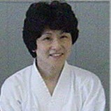
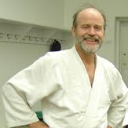
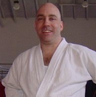

  

    
  

  

    <h2>Yukiko Katagiri</h2>
    <b>6th-dan, Shihan, Chief Instructor of Cornell Aikido Club</b>
    

      Yukiko Katagiri Sensei is 6th dan chief instructor at Cornell Aikido Club
      with over 30 years in Aikido.  Katagiri Sensei sometimes assists at Finger Lakes Aikido classes.
    

    

      Lorem ipsum dolor sit amet, consectetur adipiscing elit. Donec metus lectus, consectetur non
      lectus nec, sodales elementum nisl. Etiam eget leo eget nibh hendrerit interdum nec sit amet
      lectus. Donec lobortis massa sed mi porttitor, eget volutpat justo iaculis. Vestibulum porttitor
      molestie molestie.
    

  

  

    
  

  

    <h2>Larry Bieri</h2>
    <b>7th-dan, Shihan, Chief Instructor of Finger Lakes Aikido</b>
    

      A great sensei who has been to Japan and learned a lots of Samurai techniques.
    

    

      Nulla quis enim libero. Cras at erat diam. Nulla sodales at lectus in congue. Suspendisse
      pretium metus ut elit malesuada, a tincidunt ante dapibus. Class aptent taciti sociosqu ad
      litora torquent per conubia nostra, per inceptos himenaeos. Quisque pharetra lorem sed nisi
      tempor tempus quis a massa. 
    

  

  

    
  

  

    <h2>Mark Reichert</h2>
    <b>4th-dan, Fuku-Shido-in</b>
    

      Mark sensei has over 25 years' experience practicing Aikido, and teaches regularly
      at Cornell Aikido Club and Finger Lakes Aikido.
    

    

      Mark started his training in aikido in Ithaca in 1989. In addition to training
      under instructors of the United States Aikido Federation, Mark has focused
      on the instruction of Hiroshi Tada Sensei, 9th dan.
    

  

