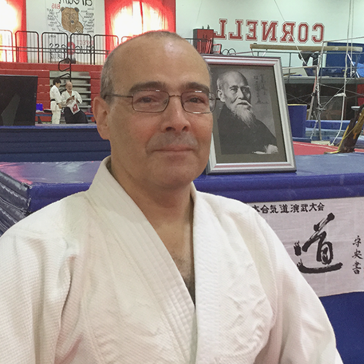

  

    
  

  

    <h2>Yukiko Katagiri</h2>
    
6th-dan, Shihan

    
Chief Instructor of Cornell Aikido Club

    

      Yukiko Katagiri Sensei set out on her Aikido journey at Aikido World Headquarters in Tokyo, 1978.  Since then she has trained under many Master Teachers of Aikido both in Japan and in the US.  She began teaching the art at the Cornell Aikido Club in 1985 as the Chief Instructor.  Currently she holds a sixth degree black belt and the title of Shihan of the United States Aikido Federation and the International Aikido Federation.  Katagiri sensei also teaches Japanese language courses at Cornell University.
    

  

  

    
  

  

    <h2>Larry E. Bieri</h2>
    
7th-dan, Shihan

    
Chief Instructor of Finger Lakes Aikido

    

      Larry E. Bieri Sensei began his study of Aikido in 1971 at the Aikido World Headquarters in Tokyo, Japan. For the next 16 years he received continuous instruction from a large number of Master Teachers, all direct students of Aikido Founder, Ueshiba Morihei. Now ranked 7th dan, Bieri Sensei also teaches Aikido at Cornell University and at the Cornell Aikido Club.
    

    

      While in Japan, Bieri Sensei also practiced "samurai" combative traditions passed down since the days of warfare with bladed weapons.  He continues to train in these arts today and this experience influences his approach to Aikido.
    

  

  

    
  

  

    <h2>Mark Reichert</h2>
    
4th-dan, Fuku-Shido-in

    
Instructor at Cornell Aikido Club

    

      Mark sensei has over 25 years' experience practicing Aikido, and teaches regularly
      at Cornell Aikido Club and Finger Lakes Aikido.
    

    

      Mark started his training in aikido in Ithaca in 1989. In addition to training
      under instructors of the United States Aikido Federation, Mark has focused
      on the instruction of Hiroshi Tada Sensei, 9th dan.
    

  

  

    
  

  

    <h2>TJ Hinrichs</h2>
    
2nd-dan

    
Instructor at Cornell Aikido Club

    

      TJ Hinrichs, 2nd-dan, has been practicing Aikido since 1985. She did most of her training under Kanai Mitsunari Shihan at New England Aikikai, and has also lived and trained in Tokyo, Taipei, Cambridge (England), New York City, New Haven, and Seoul. At Cornell, she teaches courses on Chinese medical, religious, and political history, and on the history of East Asian martial arts.
    

    

      <a href="http://history.arts.cornell.edu/faculty-department-hinrichs.php">History Department Profile</a>
    

  

  

    
  

  

    <h2>Eduardo Cunha</h2>
    
3th-dan

    
Instructor at Cornell Aikido Club

    

      Eddie has been practicing for over 30 years. He did most of his training with Kanai Mitsunari Shihan at New England Aikikai, where he also taught a regular children’s class.
    

  

