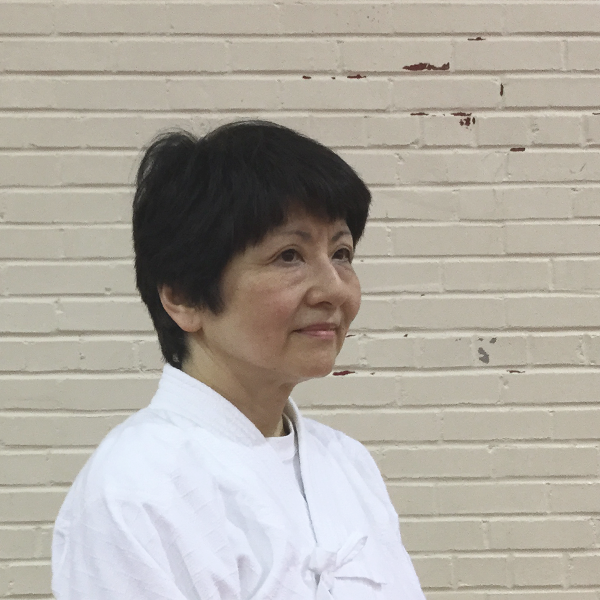
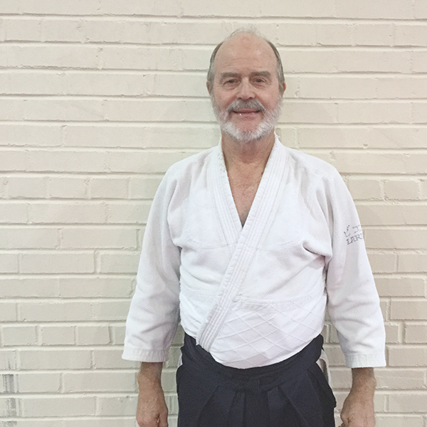
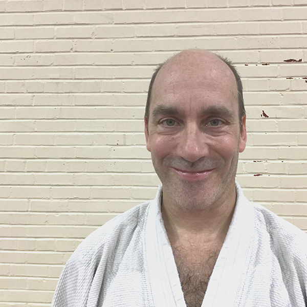
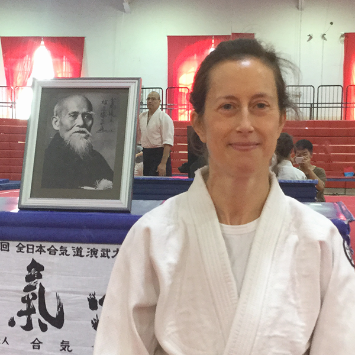
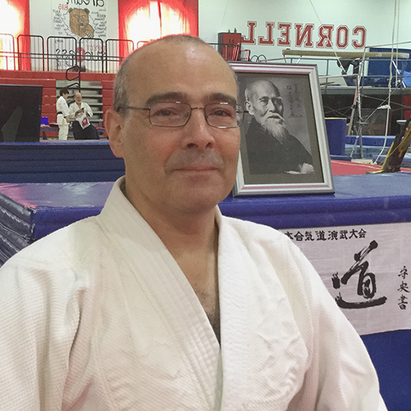
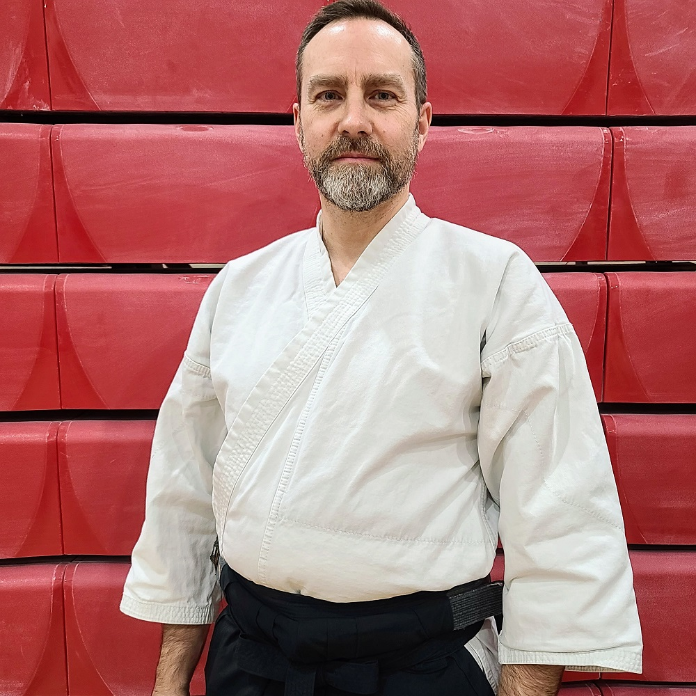

  

    
  

  

    <h2>Yukiko Katagiri</h2>
    
7th-dan, Shihan

    
Chief Instructor, Cornell Aikido Club

    

      Yukiko Katagiri Sensei set out on her Aikido journey at Hombu Dojo in 1978.
      Since then she has trained under many Master Teachers of Aikido, both in
      Japan and in the US. She began teaching as Chief Instructor at Cornell
      Aikido Club in 1985 . Currently she holds the rank of <i>rokudan</i> and
      the title of <i>Shihan</i> of the United States Aikido Federation and the
      International Aikido Federation. Katagiri Sensei also teaches Japanese
      language courses at Cornell University.
    

  

  

    
  

  

    <h2>Larry E. Bieri</h2>
    
7th-dan, Shihan

    
Chief Instructor, Finger Lakes Aikido

    

      Larry E. Bieri Sensei began his study of Aikido in 1971 at Hombu Dojo in
      Tokyo, Japan. For the next 16 years he received continuous instruction
      from a large number of Master Teachers, all direct students of O-Sensei.
      While in Japan, he also practiced <a href="https://sites.google.com/site/fingerlakeskoryu/"><i>
      koryu bujutsu</i></a>, combative traditions passed down since the days of
      samurai warfare with bladed weapons. He continues to train in these arts
      today and this experience influences his approach to Aikido. Currently,
      Bieri Sensei teaches Aikido at Finger Lakes Aikido, Cornell University,
      and Cornell Aikido Club.
    

  

  

    
  

  

    <h2>Mark Reichert</h2>
    
5th-dan, Shidoin

    
Instructor, Cornell Aikido Club

    

      Mark Sensei has over 25 years of experience practicing Aikido and teaches
      regularly at Cornell Aikido Club and Finger Lakes Aikido.
    

    

      Mark Sensei began his training in Ithaca in 1989. In addition to training
      under instructors of the United States Aikido Federation, he has focused
      on the instruction of Hiroshi Tada Sensei, 9th-dan.
    

  

  

    
  

  

    <h2>TJ Hinrichs</h2>
    
2nd-dan

    
Instructor, Cornell Aikido Club

    

      TJ Hinrichs Sensei has been practicing Aikido since 1985. She completed most
      of her training under Kanai Mitsunari Shihan at New England Aikikai, and
      has also lived and trained in Tokyo, Taipei, Cambridge (England), New York
      City, New Haven, and Seoul. At Cornell, she teaches courses on Chinese
      medical, religious, and political history, and on the history of East
      Asian martial arts.
    

    

      <a href="http://history.arts.cornell.edu/faculty-department-hinrichs.php">History Department Profile</a>
    

  

  

    
  

  

    <h2>Eduardo Cunha</h2>
    
3rd-dan

    
Instructor, Cornell Aikido Club

    

      Eddie Sensei has been practicing for over 30 years. He has studied
      primarily under Kanai Mitsunari Shihan at New England Aikikai, where he also
      taught a children’s class.
    

  

  

    
  

  

    <h2>Mike Lamont</h2>
    
3rd-dan

    
Instructor, Cornell Aikido Club

    

      Mike Sensei first started aikido in 1993 at Okanagan Aikikai in Kelowna, Canada, where he later had the privilege of being uchideshi to Kawahara Sensei in 2003.
	  Although his study was primarily under Kawahara Sensei, he has studied aikido at many dojos across the world including founding SFU AIkikai in Vancouver, Canada; and training at Ottawa Aikikai, Canada; UKA in London, UK; and Aikido Yoshinkai NSW in Sydney, Australia. He has been training with Bieri Sensei and Katagiri Sensei at Cornell since 2011.
    

  

